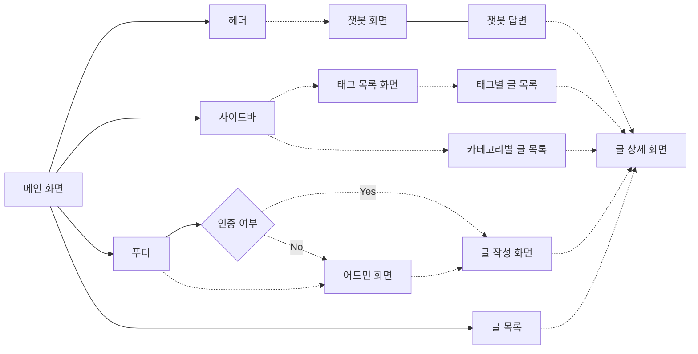

# 프로젝트 개요

이 프로젝트는 **블로그 플랫폼과 RAG(Retrieval-Augmented Generation) 기반 챗봇 시스템을 구현**하는 것을 목표로 합니다.  
작성된 글을 지식베이스로 활용하여, 블로그 내의 내용을 기반으로 사용자가 질문을 입력하면 관련 정보를 검색하고 제공할 수 있는 챗봇 시스템을 구현합니다.  

 

이 프로젝트는 다음과 같은 주요 목적을 가지고 진행하였습니다.

1. **지식베이스와 챗봇의 통합 구현**

   - 블로그에 작성된 글과 데이터를 활용해 RAG 기반의 챗봇 시스템을 구축합니다.
   - 관련된 문서를 검색하고 사용자에게 요약된 정보와 해당 정보의 출처를 함께 제공합니다.

2. **PMS 적용을 위한 기술 탐구**
   - 프로젝트 관리 도구(PMS)에서 발생하는 다양한 이슈를 효과적으로 분석하고, 과거 사례를 기반으로 해결책을 제안할 수 있는 **지식베이스 구축**의 중요성이 증가하고 있습니다.
   - 이 프로젝트는 **PMS에서 활용 가능한 기술**(이슈 생성 및 관리, 지식 기반 답변 시스템 등)을 먼저 블로그 시스템에 적용하여 실험적 구현을 수행합니다.

# 플로우 차트

